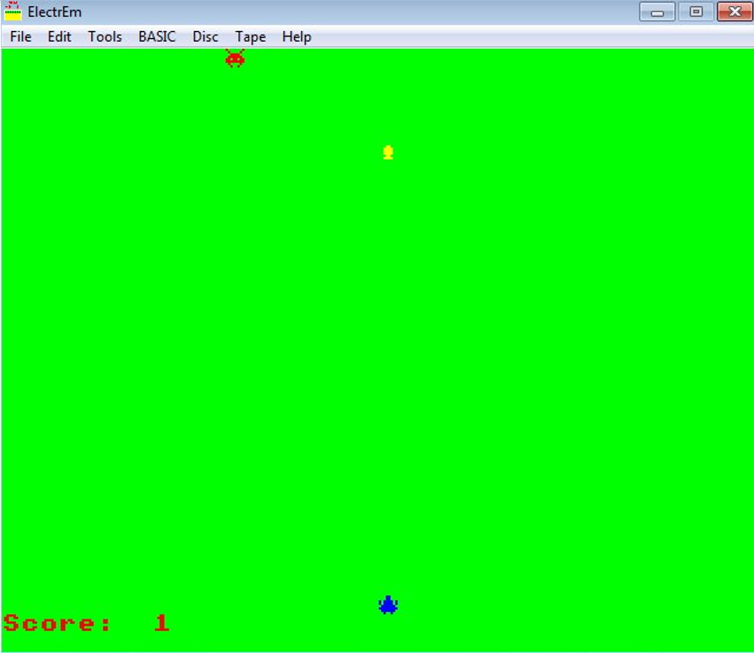

# Unfinished Space Invaders

# Directions
The SSD file is a single side disk (DFS format) - you should be able to mount it on most Acorn Electron emulators.
The following commands will then load, assemble, and run the demo:
*DISC
CHAIN "SPACE"

SSD files can also be loaded onto Acorn Electron hardware using and Elk64SD or Elk128SD device - see EBay.

Failing that Electrem and BeebEm both allow you to cut and paste the raw text provided here into the emulator.
Then just type RUN

